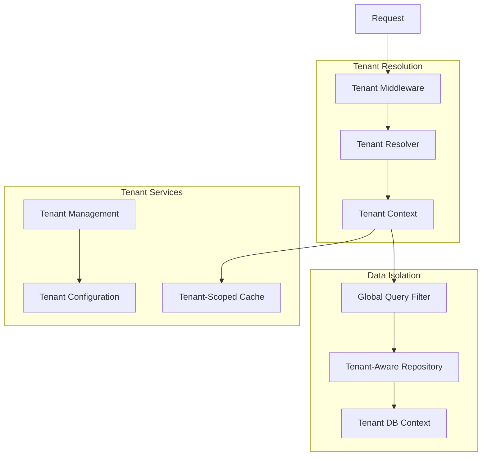

# Design Document

## Overview

The .NET 8 Clean Architecture Template is designed as a comprehensive, production-ready boilerplate that implements clean architecture principles with enterprise-grade features and multi-tenancy support. The template follows the dependency inversion principle with a clear separation of concerns across multiple layers, ensuring maintainability, testability, and scalability for SaaS modular monolith applications.

The architecture emphasizes:
- **Domain-Driven Design**: Core business logic isolated in the domain layer
- **Multi-Tenancy**: Complete tenant isolation with shared infrastructure
- **Dependency Inversion**: Outer layers depend on inner layers through abstractions
- **Cross-Cutting Concerns**: Centralized handling of logging, caching, security, and resilience
- **Configuration-Driven**: Environment-specific behavior through configuration
- **Cloud-Native**: Built for containerized deployment with observability and scalability

## Architecture

### Layer Structure


### Multi-Tenancy Architecture



### Project Structure

```
src/
├── CleanArchTemplate.API/                 # Presentation Layer
│   ├── Controllers/
│   ├── Middleware/
│   ├── Extensions/
│   ├── Filters/
│   └── Program.cs
├── CleanArchTemplate.Application/         # Application Layer
│   ├── Common/
│   │   ├── Interfaces/
│   │   ├── Behaviors/
│   │   ├── Mappings/
│   │   └── Models/
│   ├── Features/
│   │   ├── Authentication/
│   │   ├── Users/
│   │   ├── Roles/
│   │   └── Tenants/
│   └── DependencyInjection.cs
├── CleanArchTemplate.Domain/              # Domain Layer
│   ├── Entities/
│   ├── ValueObjects/
│   ├── Events/
│   ├── Exceptions/
│   └── Common/
├── CleanArchTemplate.Infrastructure/      # Infrastructure Layer
│   ├── Data/
│   │   ├── Contexts/
│   │   ├── Configurations/
│   │   ├── Repositories/
│   │   ├── Interceptors/
│   │   └── Migrations/
│   ├── Services/
│   ├── Messaging/
│   ├── Caching/
│   ├── Identity/
│   ├── MultiTenancy/
│   │   ├── TenantResolver/
│   │   ├── TenantContext/
│   │   └── TenantServices/
│   └── DependencyInjection.cs
├── CleanArchTemplate.Shared/              # Shared Layer
│   ├── Constants/
│   ├── Extensions/
│   ├── Models/
│   └── Utilities/
└── CleanArchTemplate.Contracts/           # API Contracts
    ├── Authentication/
    ├── Users/
    └── Common/

tests/
├── CleanArchTemplate.UnitTests/
├── CleanArchTemplate.IntegrationTests/
├── CleanArchTemplate.ArchitectureTests/
└── CleanArchTemplate.TestUtilities/

docker/
├── Dockerfile
├── docker-compose.yml
├── docker-compose.override.yml
└── .dockerignore

deployment/
├── ecs/
│   ├── task-definition.json
│   └── service.json
└── terraform/
```

## Components and Interfaces

### Multi-Tenancy Components

**Tenant Resolution**
```csharp
public interface ITenantResolver
{
    Task<TenantInfo> ResolveTenantAsync(HttpContext context);
    Task<TenantInfo> ResolveTenantAsync(string identifier);
}

public interface ITenantContext
{
    TenantInfo CurrentTenant { get; }
    bool IsMultiTenant { get; }
    void SetTenant(TenantInfo tenant);
}

public class TenantInfo
{
    public Guid Id { get; set; }
    public string Name { get; set; }
    public string Identifier { get; set; }
    public string ConnectionString { get; set; }
    public Dictionary<string, object> Configuration { get; set; }
    public bool IsActive { get; set; }
}
```

**Tenant Management**
```csharp
public interface ITenantService
{
    Task<TenantInfo> CreateTenantAsync(CreateTenantRequest request);
    Task<TenantInfo> GetTenantAsync(Guid tenantId);
    Task<TenantInfo> GetTenantByIdentifierAsync(string identifier);
    Task<IEnumerable<TenantInfo>> GetAllTenantsAsync();
    Task UpdateTenantAsync(Guid tenantId, UpdateTenantRequest request);
    Task DeactivateTenantAsync(Guid tenantId);
    Task<bool> TenantExistsAsync(string identifier);
}
```

**Tenant-Aware Data Access**
```csharp
public interface ITenantRepository<T> : IRepository<T> where T : ITenantEntity
{
    Task<IEnumerable<T>> GetByTenantAsync(Guid tenantId);
    IQueryable<T> QueryByTenant(Guid tenantId);
}

public interface ITenantEntity
{
    Guid TenantId { get; set; }
}
```

### Authentication and Authorization

**JWT Authentication Service**
```csharp
public interface IJwtTokenService
{
    Task<TokenResponse> GenerateTokenAsync(User user, TenantInfo tenant);
    Task<TokenResponse> RefreshTokenAsync(string refreshToken);
    Task RevokeTokenAsync(string token);
    ClaimsPrincipal ValidateToken(string token);
    TenantInfo ExtractTenantFromToken(string token);
}
```

**Tenant-Aware Role-Based Authorization**
```csharp
public interface IRoleService
{
    Task<IEnumerable<Role>> GetUserRolesAsync(Guid userId, Guid tenantId);
    Task<bool> HasPermissionAsync(Guid userId, string permission, Guid tenantId);
    Task AssignRoleAsync(Guid userId, Guid roleId, Guid tenantId);
    Task RemoveRoleAsync(Guid userId, Guid roleId, Guid tenantId);
    Task<bool> IsUserInTenantAsync(Guid userId, Guid tenantId);
}
```

### Resilience Framework

**Polly Integration**
```csharp
public interface IResilienceService
{
    Task<T> ExecuteAsync<T>(Func<Task<T>> operation, string policyName);
    Task ExecuteAsync(Func<Task> operation, string policyName);
}

// Policy configurations
- RetryPolicy: 3 attempts with exponential backoff
- CircuitBreakerPolicy: 5 failures in 30 seconds, 60-second break
- TimeoutPolicy: 30 seconds for external calls
- BulkheadPolicy: 10 concurrent executions
```

### Data Access Layer

**Repository Pattern with Unit of Work**
```csharp
public interface IRepository<T> where T : BaseEntity
{
    Task<T> GetByIdAsync(Guid id);
    Task<IEnumerable<T>> GetAllAsync();
    Task<T> AddAsync(T entity);
    Task UpdateAsync(T entity);
    Task DeleteAsync(Guid id);
    IQueryable<T> Query();
}

public interface IUnitOfWork
{
    IUserRepository Users { get; }
    IRoleRepository Roles { get; }
    Task<int> SaveChangesAsync();
    Task BeginTransactionAsync();
    Task CommitTransactionAsync();
    Task RollbackTransactionAsync();
}
```

### Caching Strategy

**Multi-Environment Tenant-Aware Caching**
```csharp
public interface ICacheService
{
    Task<T> GetAsync<T>(string key);
    Task SetAsync<T>(string key, T value, TimeSpan? expiration = null);
    Task RemoveAsync(string key);
    Task RemoveByPatternAsync(string pattern);
}

public interface ITenantCacheService : ICacheService
{
    Task<T> GetAsync<T>(string key, Guid tenantId);
    Task SetAsync<T>(string key, T value, Guid tenantId, TimeSpan? expiration = null);
    Task RemoveAsync(string key, Guid tenantId);
    Task RemoveByTenantAsync(Guid tenantId);
    Task RemoveByPatternAsync(string pattern, Guid tenantId);
}

// Implementations:
// - TenantMemoryCacheService (Development)
// - TenantRedisCacheService (Production)
// Key format: "tenant:{tenantId}:{key}"
```

### Messaging System

**AWS SQS Integration**
```csharp
public interface IMessagePublisher
{
    Task PublishAsync<T>(T message, string queueName);
    Task PublishBatchAsync<T>(IEnumerable<T> messages, string queueName);
}

public interface IMessageConsumer
{
    Task StartConsumingAsync<T>(string queueName, Func<T, Task> handler);
    Task StopConsumingAsync(string queueName);
}
```

### Observability

**OpenTelemetry Configuration**
```csharp
public interface ITelemetryService
{
    Activity StartActivity(string name);
    void RecordMetric(string name, double value, params KeyValuePair<string, object>[] tags);
    void RecordException(Exception exception);
}

// Metrics collected:
// - HTTP request duration and count
// - Database query performance
// - Cache hit/miss ratios
// - Message processing times
// - Custom business metrics
```

## Data Models

### Core Domain Entities

**Tenant Entity**
```csharp
public class Tenant : BaseAuditableEntity
{
    public string Name { get; set; }
    public string Identifier { get; set; } // Subdomain or unique identifier
    public string ConnectionString { get; set; }
    public string Configuration { get; set; } // JSON configuration
    public bool IsActive { get; set; }
    public DateTime? SubscriptionExpiresAt { get; set; }
    
    // Navigation properties
    public ICollection<User> Users { get; set; }
    public ICollection<Role> Roles { get; set; }
}
```

**User Entity**
```csharp
public class User : BaseAuditableEntity, ITenantEntity
{
    public Guid TenantId { get; set; }
    public string Email { get; set; }
    public string FirstName { get; set; }
    public string LastName { get; set; }
    public string PasswordHash { get; set; }
    public bool IsEmailVerified { get; set; }
    public DateTime? LastLoginAt { get; set; }
    public bool IsActive { get; set; }
    
    // Navigation properties
    public Tenant Tenant { get; set; }
    public ICollection<UserRole> UserRoles { get; set; }
    public ICollection<RefreshToken> RefreshTokens { get; set; }
}
```

**Role Entity**
```csharp
public class Role : BaseAuditableEntity, ITenantEntity
{
    public Guid TenantId { get; set; }
    public string Name { get; set; }
    public string Description { get; set; }
    public bool IsActive { get; set; }
    
    // Navigation properties
    public Tenant Tenant { get; set; }
    public ICollection<UserRole> UserRoles { get; set; }
    public ICollection<RolePermission> RolePermissions { get; set; }
}
```

**Base Entities**
```csharp
public abstract class BaseEntity
{
    public Guid Id { get; set; }
}

public abstract class BaseAuditableEntity : BaseEntity
{
    public DateTime CreatedAt { get; set; }
    public string CreatedBy { get; set; }
    public DateTime? UpdatedAt { get; set; }
    public string UpdatedBy { get; set; }
}

public interface ITenantEntity
{
    Guid TenantId { get; set; }
}

public abstract class BaseTenantEntity : BaseAuditableEntity, ITenantEntity
{
    public Guid TenantId { get; set; }
}
```

### Database Configuration

**PostgreSQL with EF Core and Multi-Tenancy**
- Connection pooling with max 100 connections
- Command timeout: 30 seconds
- Retry policy: 3 attempts with exponential backoff
- Migration strategy: Automatic on startup (development), Manual (production)
- Indexing strategy: Composite indexes on frequently queried columns including TenantId
- Global Query Filters: Automatic tenant filtering on all tenant entities
- Tenant Isolation: Row-level security with TenantId column
- Soft Delete: Support for tenant-aware soft deletion

**Tenant Data Isolation Strategy**
```csharp
// Global Query Filter in DbContext
protected override void OnModelCreating(ModelBuilder modelBuilder)
{
    // Apply tenant filter to all ITenantEntity implementations
    foreach (var entityType in modelBuilder.Model.GetEntityTypes())
    {
        if (typeof(ITenantEntity).IsAssignableFrom(entityType.ClrType))
        {
            var parameter = Expression.Parameter(entityType.ClrType, "e");
            var tenantProperty = Expression.Property(parameter, nameof(ITenantEntity.TenantId));
            var tenantId = Expression.Property(
                Expression.Constant(_tenantContext), 
                nameof(ITenantContext.CurrentTenant), 
                nameof(TenantInfo.Id));
            var filter = Expression.Lambda(
                Expression.Equal(tenantProperty, tenantId), 
                parameter);
            
            modelBuilder.Entity(entityType.ClrType).HasQueryFilter(filter);
        }
    }
}
```

## Error Handling

### Global Exception Handling

**Exception Middleware**
```csharp
public class GlobalExceptionMiddleware
{
    // Handles:
    // - Domain exceptions -> 400 Bad Request
    // - Validation exceptions -> 422 Unprocessable Entity
    // - Not found exceptions -> 404 Not Found
    // - Unauthorized exceptions -> 401 Unauthorized
    // - Forbidden exceptions -> 403 Forbidden
    // - Unhandled exceptions -> 500 Internal Server Error
}
```

**Custom Exception Types**
```csharp
public class DomainException : Exception
public class ValidationException : Exception
public class NotFoundException : Exception
public class UnauthorizedException : Exception
public class ForbiddenException : Exception
```

### Logging Strategy

**Structured Logging with Serilog**
```json
{
  "timestamp": "2024-01-15T10:30:00.000Z",
  "level": "Information",
  "messageTemplate": "User {UserId} performed {Action} on {Resource}",
  "properties": {
    "UserId": "123e4567-e89b-12d3-a456-426614174000",
    "Action": "Create",
    "Resource": "User",
    "CorrelationId": "abc123",
    "RequestId": "def456",
    "Duration": 150
  }
}
```

## Testing Strategy

### Unit Tests (xUnit)
- **Coverage Target**: 80% minimum
- **Mocking**: Moq for dependencies
- **Test Data**: AutoFixture for test data generation
- **Assertions**: FluentAssertions for readable tests

### Integration Tests
- **TestContainers**: PostgreSQL and Redis containers
- **WebApplicationFactory**: In-memory API testing
- **Test Database**: Isolated database per test class
- **External Services**: WireMock for HTTP dependencies

### Architecture Tests (ArchUnit.NET)
```csharp
// Enforce dependency rules
[Fact]
public void Domain_Should_Not_Depend_On_Infrastructure()
{
    var result = Types.InAssembly(DomainAssembly)
        .Should().NotDependOnAny(InfrastructureAssembly);
    result.AssertIsSuccessful();
}

// Enforce naming conventions
[Fact]
public void Controllers_Should_End_With_Controller()
{
    var result = Classes.InAssembly(ApiAssembly)
        .That().InheritFrom<ControllerBase>()
        .Should().HaveNameEndingWith("Controller");
    result.AssertIsSuccessful();
}
```

### Performance Tests
- **Load Testing**: NBomber for API load testing
- **Database Performance**: EF Core query analysis
- **Memory Profiling**: dotMemory integration
- **Benchmarking**: BenchmarkDotNet for critical paths

## Security Implementation

### API Security Measures

**Security Headers**
```csharp
app.UseSecurityHeaders(options =>
{
    options.AddDefaultSecurePolicy()
        .AddStrictTransportSecurity(maxAge: TimeSpan.FromDays(365))
        .AddContentSecurityPolicy("default-src 'self'")
        .AddXFrameOptions(XFrameOptionsPolicy.Deny)
        .AddXContentTypeOptions()
        .AddReferrerPolicy(ReferrerPolicy.StrictOriginWhenCrossOrigin);
});
```

**Rate Limiting**
```csharp
services.AddRateLimiter(options =>
{
    options.GlobalLimiter = PartitionedRateLimiter.Create<HttpContext, string>(
        httpContext => RateLimitPartition.GetFixedWindowLimiter(
            partitionKey: httpContext.User.Identity?.Name ?? httpContext.Request.Headers.Host.ToString(),
            factory: partition => new FixedWindowRateLimiterOptions
            {
                AutoReplenishment = true,
                PermitLimit = 100,
                Window = TimeSpan.FromMinutes(1)
            }));
});
```

**Input Validation**
- FluentValidation for request validation
- Model binding validation
- SQL injection prevention through parameterized queries
- XSS protection through output encoding

## Deployment Configuration

### Docker Configuration

**Multi-stage Dockerfile**
```dockerfile
FROM mcr.microsoft.com/dotnet/aspnet:8.0 AS base
WORKDIR /app
EXPOSE 8080
EXPOSE 8081

FROM mcr.microsoft.com/dotnet/sdk:8.0 AS build
WORKDIR /src
COPY ["src/CleanArchTemplate.API/CleanArchTemplate.API.csproj", "src/CleanArchTemplate.API/"]
# ... copy other projects
RUN dotnet restore "src/CleanArchTemplate.API/CleanArchTemplate.API.csproj"
COPY . .
WORKDIR "/src/src/CleanArchTemplate.API"
RUN dotnet build "CleanArchTemplate.API.csproj" -c Release -o /app/build

FROM build AS publish
RUN dotnet publish "CleanArchTemplate.API.csproj" -c Release -o /app/publish /p:UseAppHost=false

FROM base AS final
WORKDIR /app
COPY --from=publish /app/publish .
ENTRYPOINT ["dotnet", "CleanArchTemplate.API.dll"]
```

### ECS Fargate Configuration

**Task Definition**
- CPU: 512 units (0.5 vCPU)
- Memory: 1024 MB
- Network Mode: awsvpc
- Health Check: /health endpoint
- Log Driver: awslogs with CloudWatch

**Service Configuration**
- Desired Count: 2 (minimum for HA)
- Load Balancer: Application Load Balancer
- Auto Scaling: Target tracking on CPU utilization (70%)
- Deployment: Rolling update with 50% replacement

### AWS Secrets Manager Integration

**Configuration Provider**
```csharp
public static class SecretsManagerExtensions
{
    public static IConfigurationBuilder AddSecretsManager(
        this IConfigurationBuilder builder,
        string secretName,
        string region = null)
    {
        return builder.Add(new SecretsManagerConfigurationSource
        {
            SecretName = secretName,
            Region = region ?? Environment.GetEnvironmentVariable("AWS_REGION")
        });
    }
}
```

**Secret Structure**
```json
{
  "ConnectionStrings__DefaultConnection": "Host=prod-db;Database=cleanarch;Username=app;Password=secure123",
  "JwtSettings__SecretKey": "super-secret-key-256-bits-long",
  "Redis__ConnectionString": "prod-redis:6379",
  "Datadog__ApiKey": "dd-api-key",
  "AWS__AccessKey": "access-key",
  "AWS__SecretKey": "secret-key"
}
```

## Multi-Tenancy Implementation Details

### Tenant Resolution Strategies

**1. Subdomain-Based Resolution**
```csharp
public class SubdomainTenantResolver : ITenantResolver
{
    public async Task<TenantInfo> ResolveTenantAsync(HttpContext context)
    {
        var host = context.Request.Host.Host;
        var subdomain = ExtractSubdomain(host);
        return await _tenantService.GetTenantByIdentifierAsync(subdomain);
    }
    
    private string ExtractSubdomain(string host)
    {
        // Extract subdomain from host (e.g., "tenant1.myapp.com" -> "tenant1")
        var parts = host.Split('.');
        return parts.Length > 2 ? parts[0] : null;
    }
}
```

**2. Header-Based Resolution**
```csharp
public class HeaderTenantResolver : ITenantResolver
{
    public async Task<TenantInfo> ResolveTenantAsync(HttpContext context)
    {
        var tenantId = context.Request.Headers["X-Tenant-ID"].FirstOrDefault();
        if (Guid.TryParse(tenantId, out var id))
        {
            return await _tenantService.GetTenantAsync(id);
        }
        return null;
    }
}
```

**3. JWT Claims-Based Resolution**
```csharp
public class JwtTenantResolver : ITenantResolver
{
    public async Task<TenantInfo> ResolveTenantAsync(HttpContext context)
    {
        var tenantClaim = context.User.FindFirst("tenant_id")?.Value;
        if (Guid.TryParse(tenantClaim, out var tenantId))
        {
            return await _tenantService.GetTenantAsync(tenantId);
        }
        return null;
    }
}
```

### Tenant Middleware Pipeline

```csharp
public class TenantMiddleware
{
    public async Task InvokeAsync(HttpContext context, RequestDelegate next)
    {
        var tenant = await _tenantResolver.ResolveTenantAsync(context);
        
        if (tenant == null)
        {
            context.Response.StatusCode = 404;
            await context.Response.WriteAsync("Tenant not found");
            return;
        }
        
        if (!tenant.IsActive)
        {
            context.Response.StatusCode = 403;
            await context.Response.WriteAsync("Tenant is inactive");
            return;
        }
        
        _tenantContext.SetTenant(tenant);
        
        // Add tenant information to logging context
        using (LogContext.PushProperty("TenantId", tenant.Id))
        using (LogContext.PushProperty("TenantName", tenant.Name))
        {
            await next(context);
        }
    }
}
```

### Tenant-Aware Services

**Tenant Configuration Service**
```csharp
public interface ITenantConfigurationService
{
    Task<T> GetConfigurationAsync<T>(string key, T defaultValue = default);
    Task SetConfigurationAsync<T>(string key, T value);
    Task<Dictionary<string, object>> GetAllConfigurationAsync();
}
```

**Tenant Feature Flags**
```csharp
public interface ITenantFeatureService
{
    Task<bool> IsFeatureEnabledAsync(string featureName);
    Task<T> GetFeatureConfigurationAsync<T>(string featureName);
    Task EnableFeatureAsync(string featureName);
    Task DisableFeatureAsync(string featureName);
}
```

This design provides a comprehensive foundation for building enterprise-grade .NET 8 SaaS applications with clean architecture principles and robust multi-tenancy support, incorporating all the requested features while maintaining flexibility and extensibility.