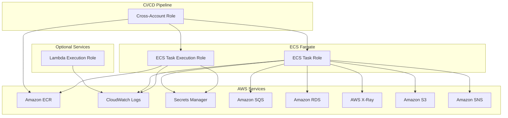

# IAM Implementation Guide

This document describes the IAM roles and policies implementation for the Clean Architecture Template.

## Overview

The IAM module implements a comprehensive set of roles and policies following AWS security best practices and the principle of least privilege. It provides secure access for ECS tasks, CI/CD pipelines, and optional Lambda functions.

## Architecture



## Roles and Responsibilities

### 1. ECS Task Execution Role

**Purpose**: Used by the ECS service to manage container lifecycle
**Principal**: `ecs-tasks.amazonaws.com`

**Permissions**:
- **ECR Access**: Pull container images from ECR repositories
- **CloudWatch Logs**: Create log groups and streams, write log events
- **Secrets Manager**: Retrieve secrets for container environment variables

**Security Features**:
- Account-based conditions to prevent cross-account access
- Resource-specific ARNs instead of wildcards
- Minimal permissions required for container startup

### 2. ECS Task Role

**Purpose**: Used by the application running inside containers
**Principal**: `ecs-tasks.amazonaws.com`

**Permissions**:
- **Secrets Manager**: Read application secrets and database credentials
- **SQS**: Send, receive, and delete messages from application queues
- **CloudWatch**: Write custom metrics and application logs
- **X-Ray**: Send trace segments for distributed tracing
- **S3**: Read/write access to application buckets (optional)
- **SNS**: Publish notifications to topics (optional)
- **RDS**: Connect via IAM authentication (optional)

**Security Features**:
- Namespace-restricted CloudWatch metrics
- Resource-specific permissions for each service
- Conditional access based on source account
- Enhanced security policies for production environments

### 3. CI/CD Cross-Account Role

**Purpose**: Allows CI/CD pipelines from other AWS accounts to deploy
**Principal**: Specified CI/CD account IDs

**Permissions**:
- **ECS**: Update services, register task definitions
- **ECR**: Push and pull container images
- **IAM**: Pass roles to ECS tasks

**Security Features**:
- External ID requirement for role assumption
- Resource-specific permissions limited to application resources
- Account ID validation in assume role policy

### 4. Lambda Execution Role (Optional)

**Purpose**: For Lambda functions that may be part of the application
**Principal**: `lambda.amazonaws.com`

**Permissions**:
- **CloudWatch Logs**: Basic execution logging
- **VPC Access**: Network access if Lambda runs in VPC (optional)

## Security Best Practices Implemented

### 1. Principle of Least Privilege
- Each role has only the minimum permissions required
- Resource ARNs are explicitly specified
- Actions are limited to what's actually needed

### 2. Defense in Depth
- Multiple layers of security controls
- Account-based conditions in policies
- Resource-based restrictions
- Environment-specific security enhancements

### 3. Secure Cross-Account Access
- External ID requirement for CI/CD access
- Account ID validation in assume role policies
- Limited permissions for cross-account operations

### 4. Monitoring and Auditing
- All roles support CloudTrail logging
- Custom metrics for monitoring access patterns
- Structured logging for security events

## Environment-Specific Configurations

### Development Environment
- Basic security controls
- Minimal logging retention
- Simplified permissions for development workflows

### Staging Environment
- Enhanced monitoring
- Longer log retention
- Production-like security controls for testing

### Production Environment
- Maximum security controls
- Extended log retention
- Additional deny policies for sensitive operations
- Service-linked role creation
- Enhanced resource-based conditions

## Deployment

### Prerequisites
1. AWS CLI configured with appropriate permissions
2. Terraform >= 1.5 installed
3. Backend S3 bucket and DynamoDB table configured

### Deployment Steps

1. **Validate Configuration**:
   ```powershell
   .\scripts\validate-iam.ps1 -Environment dev
   ```

2. **Plan Deployment**:
   ```powershell
   .\scripts\deploy-iam.ps1 -Environment dev -Action plan
   ```

3. **Apply Changes**:
   ```powershell
   .\scripts\deploy-iam.ps1 -Environment dev -Action apply
   ```

### Configuration Variables

Update the environment-specific `.tfvars` files with your configuration:

```hcl
# CI/CD Configuration
cicd_account_ids    = ["123456789012"]
cicd_external_id    = "unique-external-id"
ecr_repository_arns = ["arn:aws:ecr:us-east-1:123456789012:repository/cleanarch"]

# Optional Services
enable_xray       = true
enable_s3_access  = true
s3_bucket_arns    = ["arn:aws:s3:::my-app-bucket"]
enable_sns_access = true
sns_topic_arns    = ["arn:aws:sns:us-east-1:123456789012:notifications"]
```

## Integration with Other Modules

### ECS Module Integration
The IAM module provides role ARNs to the ECS module:
```hcl
module "ecs" {
  # ... other configuration
  ecs_task_execution_role_arn = module.iam.ecs_task_execution_role_arn
  ecs_task_role_arn          = module.iam.ecs_task_role_arn
}
```

### Secrets Manager Integration
IAM roles are configured to access specific secrets:
```hcl
secrets_manager_arns = [
  module.rds.secret_arn,
  module.app_secrets.secret_arn
]
```

### SQS Integration
When SQS queues are created, their ARNs are provided to IAM:
```hcl
sqs_queue_arns = [
  module.sqs.queue_arns["main"],
  module.sqs.queue_arns["dlq"]
]
```

## Monitoring and Troubleshooting

### CloudTrail Events
Monitor these CloudTrail events for IAM activity:
- `AssumeRole` - Role assumptions
- `GetSecretValue` - Secret access
- `SendMessage` - SQS operations
- `PutMetricData` - CloudWatch metrics

### Common Issues

1. **Permission Denied Errors**:
   - Check resource ARNs in policies
   - Verify account ID conditions
   - Ensure role trust relationships are correct

2. **Cross-Account Access Issues**:
   - Verify external ID configuration
   - Check CI/CD account IDs in assume role policy
   - Ensure ECR repository ARNs are correct

3. **Secret Access Issues**:
   - Verify secret ARNs in IAM policies
   - Check secret resource policies
   - Ensure secrets exist in the same region

### Debugging Commands

```bash
# Check role policies
aws iam get-role --role-name cleanarch-dev-ecs-task-role

# List attached policies
aws iam list-attached-role-policies --role-name cleanarch-dev-ecs-task-role

# Test secret access
aws secretsmanager get-secret-value --secret-id cleanarch-dev-db-secret
```

## Security Considerations

### Regular Reviews
- Review IAM policies quarterly
- Audit role usage with CloudTrail
- Remove unused permissions
- Update resource ARNs as needed

### Compliance
- Policies support SOC 2 compliance
- GDPR considerations for data access
- PCI DSS requirements for payment processing
- HIPAA compliance for healthcare data

### Incident Response
- IAM changes are logged in CloudTrail
- Role assumptions can be monitored
- Emergency access procedures documented
- Automated remediation for policy violations

## Future Enhancements

### Planned Features
- AWS Config rules for policy compliance
- Automated policy optimization
- Integration with AWS Organizations SCPs
- Custom permission boundaries

### Monitoring Improvements
- CloudWatch dashboards for IAM metrics
- Automated alerts for unusual access patterns
- Integration with security information systems
- Regular access reviews and reporting

## References

- [AWS IAM Best Practices](https://docs.aws.amazon.com/IAM/latest/UserGuide/best-practices.html)
- [ECS Task IAM Roles](https://docs.aws.amazon.com/AmazonECS/latest/developerguide/task-iam-roles.html)
- [Cross-Account Access](https://docs.aws.amazon.com/IAM/latest/UserGuide/tutorial_cross-account-with-roles.html)
- [AWS Security Best Practices](https://aws.amazon.com/architecture/security-identity-compliance/)